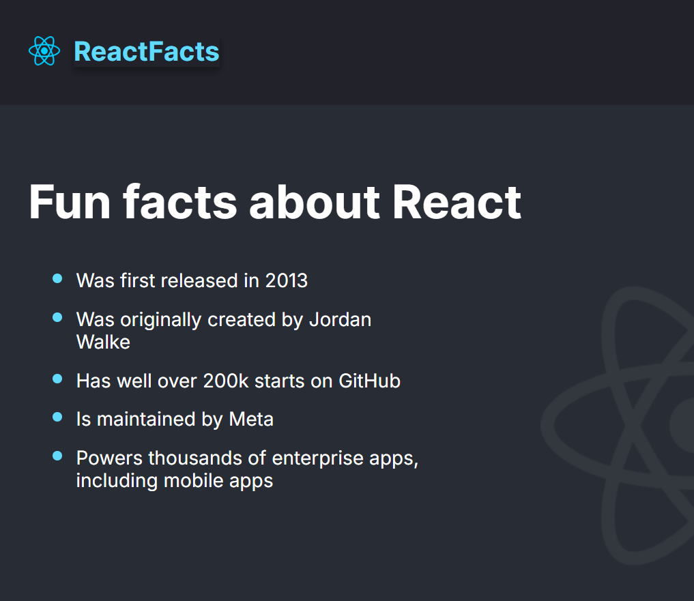
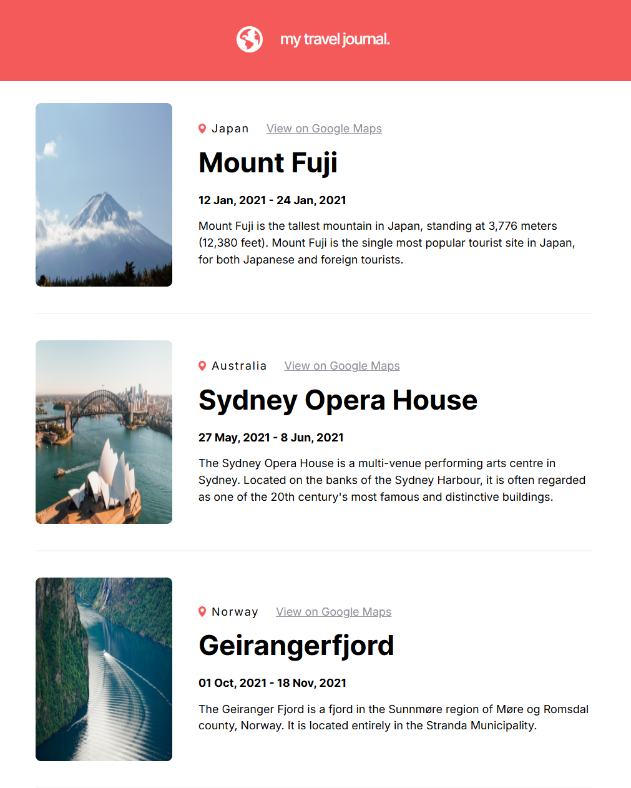
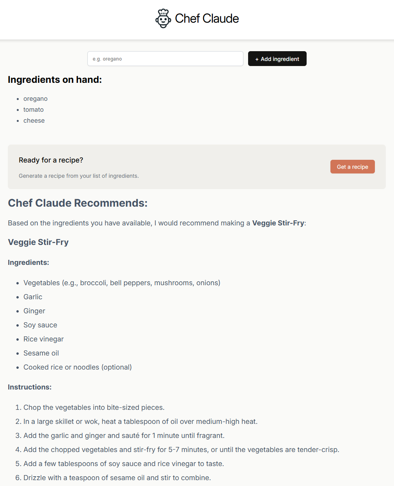
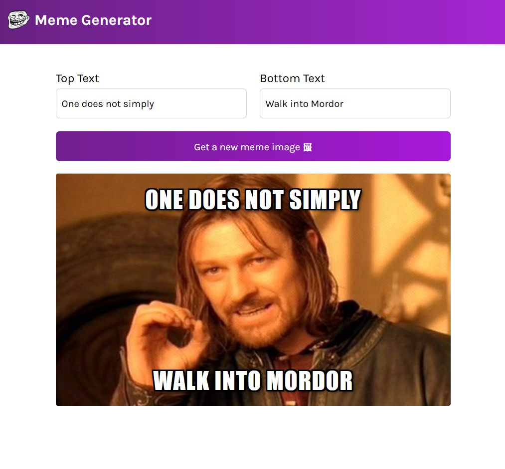
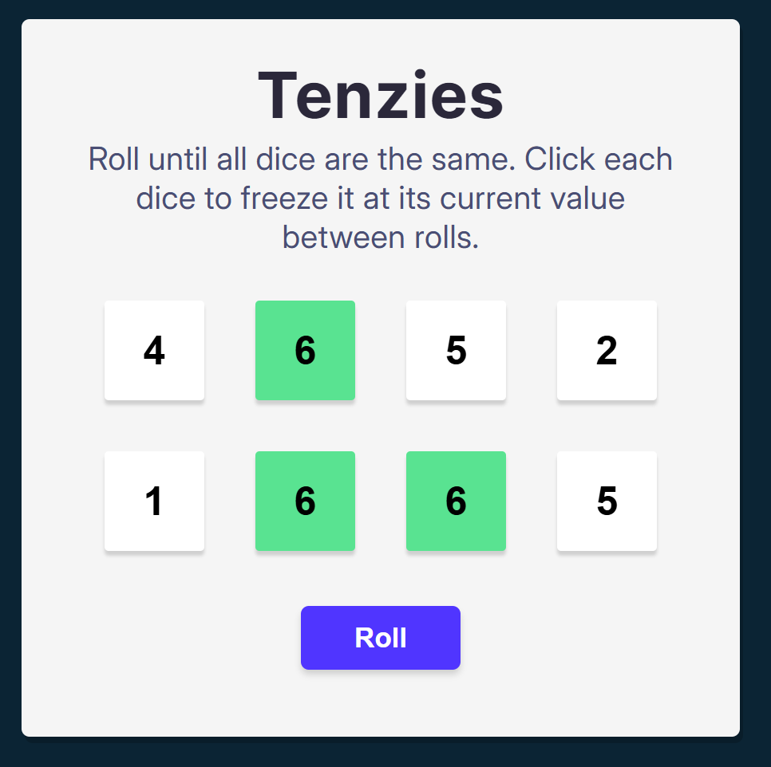
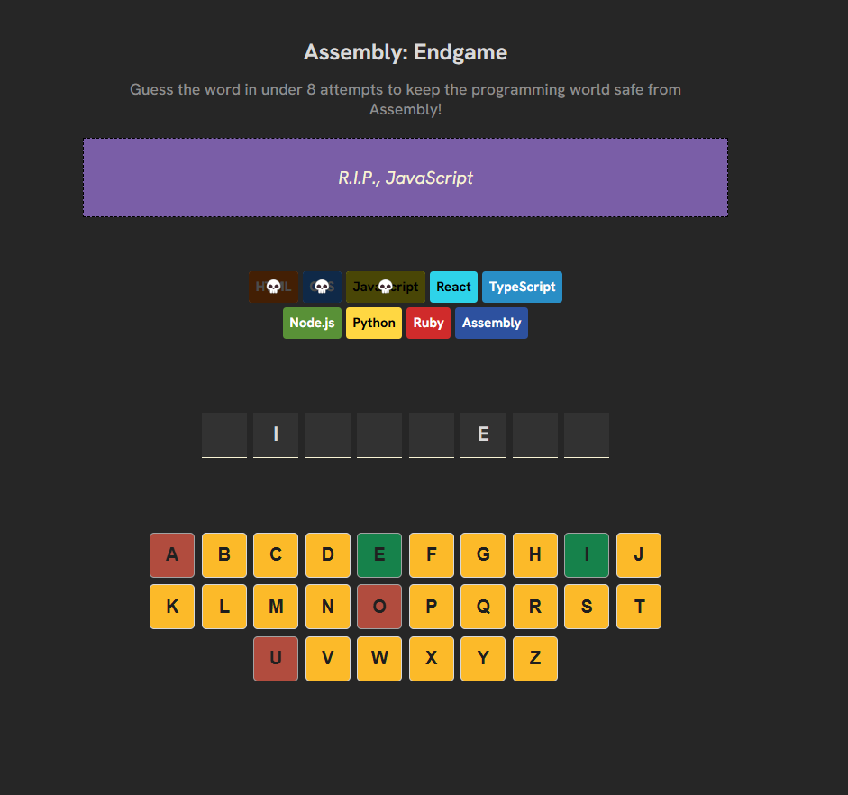

# React Mini-Projects

A collection of 6 mini-projects built while learning React. These projects demonstrate a variety of React concepts, including components, state management, hooks, and routing.

---

## Table of Contents

1. [Introduction](#introduction)
2. [Projects Overview](#projects-overview)
3. [Technologies Used](#technologies-used)
4. [Getting Started](#getting-started)
5. [How to Run Each Project](#how-to-run-each-project)
6. [Project Details](#project-details)
   - [Project 1: React Fun Facts](#project-1-react-fun-facts)
   - [Project 2: Travel Journal](#project-2-travel-journal)
   - [Project 3: Chef Claude](#project-3-chef-claude)
   - [Project 4: Meme Generator](#project-4-meme-generator)
   - [Project 5: Tenzies](#project-5-tenzies)
   - [Project 6: Assembly Endgame](#project-6-assembly-endgame)
7. [Contributing](#contributing)
8. [License](#license)
9. [Acknowledgments](#acknowledgments)

---

## Introduction

This repository contains six mini-projects developed while learning React. The projects range from simple UI components to more complex applications utilizing React hooks and state management techniques. The goal was to practice and understand core React concepts through practical examples.

---

## Projects Overview

Here is a brief overview of each project:

- **React Fun Facts** - A little list with interesting data about React.
- **Travel Journal** - A series of traveling recommendations.
- **Chef Claude** - A Claude-based page to generate recipes based on a list of ingredients.
- **Meme Generator** - A meme template web application allowing users to create memes with custom texts and images.
- **Tenzies** - An implementation of the famous Tenzies game; roll all dice to the same value to win.
- **Assembly Endgame** - A hangman-like game where each incorrect guess eliminates a programming language.

---

## Technologies Used

- React 19
- JavaScript (ES6+)
- CSS
- Claude

---

## Getting Started

To get started with any of these projects, ensure you have **Node.js** installed on your system.

````bash
# Clone the repository
git clone https://github.com/DCRobledo/Frontend-Web

# Navigate into the project directory
cd Front-Web

# Install dependencies
npm install
````

---

## How to Run Each Project

Each project is contained in its own directory. Navigate to the project folder and start the development server to view the project in your browser.
````bash
# Navigate to the project folder
cd 01_ReactFunFacts

# Start the development server
npm run dev
````

---

## Project Details

### Project 1: React Fun Facts

- **Description:** A little list with interesting data about React.
- **Features:**
   - Basic structure and style
   - Background image
   - Component modularization
- **Concepts Practiced:** Fundamentals of React


  

---

### Project 2: Travel Journal

- **Description:** A series of traveling recommendations.
- **Features:**
   - Reusable styles
   - Data loading from a JSON-like structure
- **Concepts Practiced:** Data loading



---

### Project 3: Chef Claude

- **Description:** A Claude-based page to generate recipes based on a list of ingredients.
- **Features:**
   - Add ingredients to a list
   - Generate a recipe using Claude
- **Concepts Practiced:** API calls



---

### Project 4: Meme Generator

- **Description:** A meme template web application allowing users to create memes with custom texts and images.
- **Features:**
   - Write text on the meme
   - Generate new images using imgflip
- **Concepts Practiced:** Side effects



---

### Project 5: Tenzies

- **Description:** An implementation of the famous Tenzies game; roll all dice to the same value to win.
- **Features:**
   - Roll dice
   - Freeze dice values
- **Concepts Practiced:** State and effects



---

### Project 6: Assembly Endgame

- **Description:** A hangman-like game where each incorrect guess eliminates a programming language.
- **Features:**
   - Random word generation
   - Both mouse and keyboard input
   - Conditional rendering
- **Concepts Practiced:** Refs



---

## License

This project is licensed under the MIT License - see the [LICENSE](LICENSE) file for details.

---

## Acknowledgments

- Special thanks to the [Scrimba React Course](https://scrimba.com/learn-react-c0e) and its instructor(s) for providing the foundational knowledge and inspiration for these projects.
- Gratitude to the React community and various online resources for guidance and support.

---
